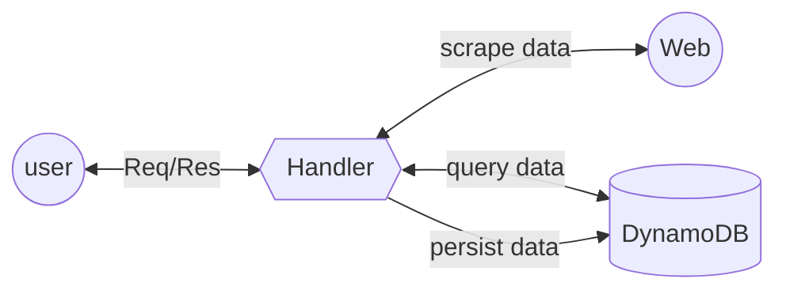

<!--
title: 'Web Scrapper API'
description: 'This a web scrapper application which can be used extract open graph parameters and various other contents from web pages. This Application is developed using serverless-aws written in nodeJS and persists data to dynamoDB table with Caching implemented at API Gateway.'
layout: Doc
framework: v1
platform: AWS
language: nodeJS
authorLink: 'https://github.com/prakashtendlya/'
authorName: 'Prakash Arumugam'
-->
# Web Scrapper API

This a web scrapper application which can be used extract open graph parameters and various other contents from web pages. This Application is developed using serverless-aws written in nodeJS and persists data to dynamoDB table with Caching implemented at API Gateway.

## Description

This service has it's core logic implemented in `hanlder.js` which is to get url from user request, check dynamoDB for data, if data exists return response, else collect web content using `axios`, parse data using `cheerio`, validate open graph, image data using `regex`, persista data to dynamoDB and share `Success` response to user. The service validates url , web content and shares `Bad` response to user.

This service has a separate directory for helper operations `service/helper.js` which helps in validataing/scrapping `og:data` & `images`, also in querying/creating data against dynamoDB.

### API Workflow

Incoming Request >> check DynamoDB table for url >> if(data) >> exists >> return response with data to user
                                                             >> notfound >> pull content from web page using url >> if(content) >> found >> persists to DB >> return response with data to user
                                                                                                                                >> notfount >> return BAD RESPONSE



## Use-cases

- Scrape open graph parameters in web pages

## Setup

```bash
npm install
```

installs `axios` `cheerio`  `aws-sdk` `serverless-api-gateway-caching` `uuid` dev dependencies `serverless-offline` `nodemon` `jest`

```json
{ "devDependencies": {
    "jest": "^28.1.3",
    "nodemon": "^2.0.19",
    "serverless-offline": "^9.1.6"
  },
  "dependencies": {
    "aws-sdk": "^2.1189.0",
    "axios": "^0.27.2",
    "cheerio": "^1.0.0-rc.12",
    "serverless-api-gateway-caching": "^1.8.1",
    "uuid": "^8.3.2"
  }
}
```

## Run offline 

uses serverless offline and nodemon

```bash
npm start
```

The expected result should be similar to:

```bash
npm WARN config global `--global`, `--local` are deprecated. Use `--location=global` instead.

> web-scrapper@1.0.0 start
> nodemon --exec "serverless offline start"

[nodemon] 2.0.19
[nodemon] to restart at any time, enter `rs` 
[nodemon] watching path(s): *.*
[nodemon] watching extensions: js,mjs,json   
[nodemon] starting `serverless offline start`

Starting Offline at stage dev (ap-south-1)

Offline [http for lambda] listening on http://localhost:3002
Function names exposed for local invocation by aws-sdk:
           * scrape: web-scrapper-dev-scrape

   ┌──────────────────────────────────────────────────────────────────────────┐
   │                                                                          │
   │   POST | http://localhost:3000/dev/scrapeData                            │
   │   POST | http://localhost:3000/2015-03-31/functions/scrape/invocations   │
   │                                                                          │
   └──────────────────────────────────────────────────────────────────────────┘

Server ready: http://localhost:3000 🚀
```

## Run unit tests

uses jest for unit testing

```bash
npm start
```

The expected result should be similar to:

```bash
npm WARN config global `--global`, `--local` are deprecated. Use `--location=global` instead.

> web-scrapper@1.0.0 test
> jest

 PASS  test/helper.unit.test.js 
  √ default options (3 ms)
  √ regex test (2 ms)

 PASS  test/handler.unit.test.js
  √ success is an object (4 ms)
  √ success response
  √ bad response (1 ms)

Test Suites: 2 passed, 2 total
Tests:       5 passed, 5 total
Snapshots:   0 total
Time:        3.196 s
Ran all test suites.
```

## Deploy

In order to deploy the endpoint simply run

```bash
serverless deploy
```

The expected result should be similar to:

```bash
Serverless: Packaging service…
Serverless: Uploading CloudFormation file to S3…
Serverless: Uploading service .zip file to S3…
Serverless: Updating Stack…
Serverless: Checking Stack update progress…
Serverless: Stack update finished…

Service Information
service: web-scrapper
stage: dev
region: ap-south-1
api keys:
  None
endpoint: POST - https://bmfl3sbnl6.execute-api.ap-south-1.amazonaws.com/dev/scrapeData
functions:
  scrape: web-scrapper-dev-scrape
```

## Usage

This service can be used to pull contents from web pages, collate open graph parameters and html content and store it in NoSQL

### Scrape Data from a web page

```bash
curl -X POST 'https://bmfl3sbnl6.execute-api.ap-south-1.amazonaws.com/dev/scrapeData' \ --header 'Content-Type: application/json' \ --data-raw '{ "url": "https://www.facebook.com" }'
```

Example Result:
```bash
{    "og:locale": "ar_AR",    "og:image": "https://www.facebook.com/images/fb_icon_325x325.png",    "images": [        "https://static.xx.fbcdn.net/rsrc.php/y8/r/dF5SId3UHWd.svg",        "https://facebook.com/security/hsts-pixel.gif?c=3.2.5"    ],    "og:site_name": "Facebook",    "title": "فيسبوك - تسجيل الدخول أو الاشتراك",    "og:url": "https://www.facebook.com/" }
```

## Configurations

### Handler

The scrape function is configure with run time environment being "nodejs12.x" on region "ap-south-1" with default stage set to "dev". The scrape function accepts API Gateway event consisting of "POST" Request with path "/scrapeData".
Caching has been enabled for the request in API Gateway explicitly as AWS defaults POST Request cache to "disabled". Cache duration is mentioned in seconds 120.

```yaml
provider:
  name: aws
  runtime: nodejs12.x
  stage: dev
  region: ap-south-1
functions:  
  scrape:
    handler: app/handler.scrape
    events:
      - http:
          path: /scrapeData
          method: post
          caching:
            enabled: true
            ttlInSeconds: 120
```

### DynamoDB

DynamoDB table is configured with two HASH Keys, the primary being id - string(uuid)  and the global secondary being url - string(projects->ALL) which would help us query database to check if url already persists.
The Table is explicityly set to "ProvisionedThroughput" with both "ReadCapacityUnits", "WriteCapacityUnits" set to 1 Unit which can be reconfigured as per usage.
NOTE: You have to provide permission explicitly to your lambda for accessing GSI.

```yaml
resources:
  Resources:
    UserTable:
      Type: 'AWS::DynamoDB::Table'
      Properties:
        AttributeDefinitions:
          -
            AttributeName: id
            AttributeType: S
          -
            AttributeName: url
            AttributeType: S
        KeySchema:
          -
            AttributeName: id
            KeyType: HASH
        GlobalSecondaryIndexes:
          - IndexName: ${self:custom.tableIndex}
            KeySchema:
              - AttributeName: url
                KeyType: HASH
            Projection:
              ProjectionType: 'ALL'
            ProvisionedThroughput:
              ReadCapacityUnits: 1
              WriteCapacityUnits: 1
        ProvisionedThroughput:
          ReadCapacityUnits: 1
          WriteCapacityUnits: 1
        TableName: ${self:custom.tableName}
```

Sample DynamoDB Record:

id  - PrimaryKey  Type - string(uuid)
url - GSI         Type - string
data- attributte  Type - Object

```json
{
 "id": "4fa490a0-16da-11ed-b5fe-430f9c2844d3",
 "data": {
  "images": [
   "https://static.xx.fbcdn.net/rsrc.php/y8/r/dF5SId3UHWd.svg",
   "https://facebook.com/security/hsts-pixel.gif?c=3.2.5"
  ],
  "og:image": "https://www.facebook.com/images/fb_icon_325x325.png",
  "og:locale": "ar_AR",
  "og:site_name": "Facebook",
  "og:url": "https://www.facebook.com/",
  "title": "فيسبوك - تسجيل الدخول أو الاشتراك"
 },
 "url": "https://www.facebook.com"
}
```
